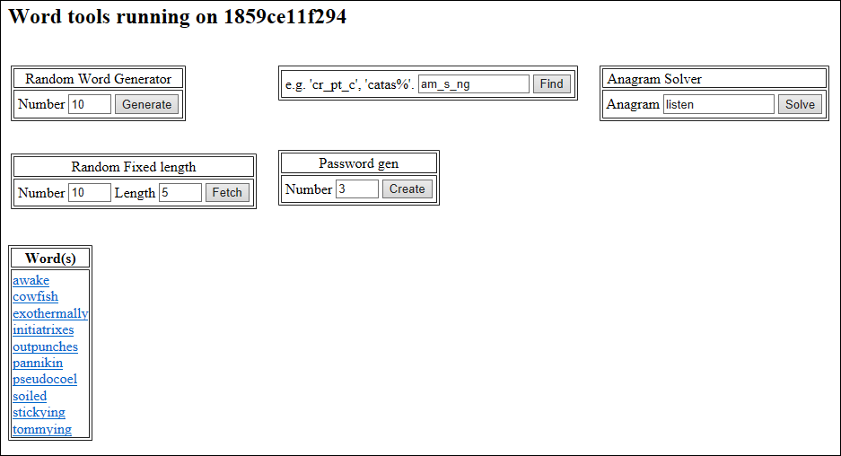

# Word finder

A web-based collection of word finding tools, consisting of:
- Database layer - an indexed word dictionary, implemented with MySQL.
- API layer - providing word search, anagram, random word functions via a REST API, implemented with Python Bottle micro-web framework.
- Presentation layer - web UI which calls the API layer, also implemented with Bottle.



There are more efficient ways to load and index a dictionary style list of words than to use a database server, but the purpose of this app is to demonstrate a simple micro-service architecture. Each layer is implemented as a container, can be deployed as a set of inter-related containers in a pod, and scaled horizontally as needed.

To run the app you can simply download _docker-compose.yml_ and run _docker-compose up -d_ to get the containers from Docker Hub and run them. Alternatively you can adapt the build script and Dockerfiles for your own purposes and create your own app.

### Installation

Tested on an Ubuntu 16.04-LTS VM. 

  1. Optional - Install Python 3.x (if you plan to build the containers). 
  2. Install Docker and docker-compose.
  3. Clone repo, or just copy the docker-compose.yaml file if you don't plan to build the containers.
  4. Set $MYSQL_ROOT_PASSWORD $MYSQL_DATABASE, $MYSQL_USER and $MYSQL_PASSWORD environment variables (use setenv.sh.tmlp as a template).\
     ```
      export MYSQL_DATABASE=worddb
      export MYSQL_USER=worduser
      export MYSQL_PASSWORD=set-a-password-of-your-choice-here
      export MYSQL_ROOT_PASSWORD=set-a-password-ofyour-choice-here
     ``` 
  5. Optional - Run: bash ./build_containers.sh - this builds and pushes the containers. Edit the file for your docker hub account.
  6. Run: docker-compose up -d
  7. Connect to the web UI endpoint, e.g. http://yourvmdns:8080
  8. Shutdown app with: docker-compose stop

 ### Troubleshooting docker-compose
 - Make sure your container has standalone tests to check it came up ok, and simple layer connectivity tests to confirm networking etc. 
 - You can stop and then bring up a container in foreground to see output, e.g. 
  ```
  docker-compose wordtools-data stop
  docker-compose wordtools-data up
  ```
- Also look at the container logs: _docker logs wordtools-data_

 ### Converting to a Kubernetes cluster on Azure
1. Install [Azure CLI](https://github.com/Azure/azure-cli)
2. Set up CLI environment: az login
3. Create a resource group and a kubernetes ACS cluster e.g.
   ```
   az group create -n yourk8rg --location northeurope
   az acs create -n yourk8clust -g yourk8rg --orchestrator-type=kubernetes 	--generate-ssh-key  --dns-prefix=a-unique-dns-prefix
   ```
4. Make a local copy of the Kubernetes configuration:
   ```
   az acs kubernetes get-credentials -g yourk8rg -n yourk8clus
   cp ~/.kube/config .
   export KUBECONFIG=`pwd`/config
   ```
5. Install kompose:
   ```
   curl -L https://github.com/kubernetes-incubator/kompose/releases/download/v0.2.0/kompose-linux-amd64 -o kompose
   chmod +x kompose
   sudo mv ./kompose /usr/local/bin/kompose
   ```
6. Do a simple conversion to kubernetes pods:
   ```
   . ./setenv.sh # set runtime environement variables
   kompose --file ./docker-compose.yml up
   ```
   In the spec replace the type to LoadBalancer
 
 7. Edit the cluster config file to load balance from an external IP address.
   ```
   kubectl edit svc/wordtools-presentation
   ```

   Then a few minutes later editing the file again will show it has a public IP address you can browse to.

 ### Troubleshooting Kubernetes
 To get to the logs, e.g. _kubectl logs pod-name [container name]_


 